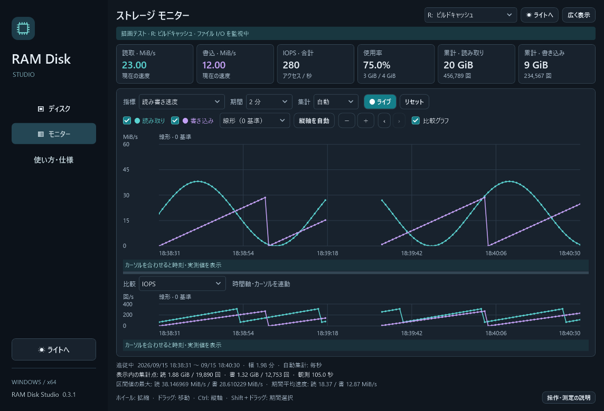

# RAM Disk Studio

ImDisk を使って RAM ドライブを作成・管理する、日本語の Windows デスクトップアプリです。C# / WPF / .NET 10 で実装しています。SoftPerfect RAM Disk とは無関係の独立したプロジェクトです。



画面はサンプルデータによる表示例です。現在のバージョンは **0.3.1** です。

## 起動

1. [ImDisk 公式サイト](https://www.ltr-data.se/opencode.html/#ImDisk) から **ImDisk Virtual Disk Driver** をインストールします。物理メモリ固定を使う場合は awealloc も導入します。
2. [ビルド・検証](#ビルド検証) の手順でアプリを生成し、`artifacts/release/RamDiskStudio.exe` を起動します。同じフォルダーの DLL・JSON ファイルも必要です。
3. 「管理者として再起動」を押します。設定の閲覧・保存だけなら管理者権限は不要です。
4. 「ディスクを追加」で名前、容量、ドライブ文字、形式を指定して保存します。
5. 一覧で設定を選び「作成」を押します。「開く」でエクスプローラーを開けます。

実行には .NET 10 Desktop Runtime の x64 版が必要です。ドライバーはアプリには同梱していません。

## 機能

- 複数ディスクの設定保存・編集・削除、作成・安全な解除
- D～Z の空いているドライブ文字、MiB / GiB による容量指定
- NTFS / exFAT / FAT32（FAT32 は 256 MiB～32 GiB に制限）
- 標準メモリ（ImDisk VM）・物理メモリ固定（awealloc）の選択
- 作成時の `Temp` フォルダー生成
- アプリ起動時に指定ディスクを自動作成（管理者権限がある場合）
- システムの空き RAM、稼働ディスク数、ディスク空き容量の表示
- ドライバー未導入・権限不足の案内、最近の操作結果の表示
- ドライブ別の読み書きグラフ、使用容量の推移、永続的な累計と履歴
- マウスでの拡縮・移動・期間選択、対数 / 変化を強調する縦軸、連動する比較グラフ
- ライト / ダークの切り替えとテーマの保存（グラフ・設定画面・確認ダイアログにも適用）

## テーマ

初期表示はダークです。サイドバー下部、またはモニター右上の「☀ ライトへ」「☾ ダークへ」で即座に切り替えられます。グラフの表示期間・拡大率を維持し、開いている設定画面にも反映します。

選択は `%LOCALAPPDATA%\RamDiskStudio\appearance.json` に保存し、次回起動時に復元します。ドライブの設定と監視履歴はそれぞれ別ファイルです。テーマ設定が読み取れない場合はダークで起動します。

## 物理メモリ固定（awealloc）

「ディスクを追加」→「メモリ方式」で **物理メモリ固定（awealloc）** を選び、設定を保存してから「作成」を押します。設定画面に awealloc の導入状況を表示します。NTFS / exFAT / FAT32、読み書きグラフ、容量監視、履歴保存を利用できます。

作成時に指定した容量を物理 RAM に確保します。標準メモリ方式と同様に OS 用の空きメモリを残す容量検査を行います。稼働中のドライブの方式は変更できません。既存ドライブを切り替える場合は必要なファイルを別ドライブへ保存し、解除・設定変更・再作成後に戻してください。

**ImDisk 2.1.2 以降は awealloc を同梱していません。** 現在は [Arsenal Image Mounter の公式ドライバーパッケージ](https://github.com/ArsenalRecon/Arsenal-Image-Mounter/tree/master/DriverSetup) に含まれます。[移転の公式告知](https://www.ltr-data.se/opencode.html/changelog.html)

このプロジェクトの Windows x64 用セットアップ手順:

1. 公式 `DriverFiles.zip` を `artifacts/awealloc-download/DriverFiles.zip` に保存し、`artifacts/awealloc-download/package` へ展開します。
2. 管理者 PowerShell で `./scripts/install-awealloc-and-test.ps1` を実行します。
3. スクリプトは検証済みの awealloc 1.2.29.95 のハッシュ・署名を確認し、公式カタログを登録した後、awealloc サービスを登録・起動します。ImDisk の入れ替えや稼働中ディスクの解除は行いません。
4. テスト用 64～256 MiB の RAM ディスクを作成し、物理メモリ方式・形式・読み書き・監視・解除を検証します。テスト用ディスクは終了時に消去します。

パッケージが将来更新されてハッシュが変わった場合、このスクリプトは導入せず停止します。別バージョンの導入済みドライバーも自動で置き換えません。awealloc 自体はアプリの ZIP には同梱しません。

## ストレージ モニター

管理者として起動し、左側の「モニター」を選びます。アプリで作成した RAM ドライブを選び、指標と集計間隔を切り替えてください。アプリ起動中はモニター画面を閉じていても記録します。

| 指標 | 表示内容 |
|---|---|
| 読み書き速度 | 読み取り・書き込みの MiB/秒（区間の観測時間で平均） |
| 読み書き量 | 区間内の読み取り・書き込み量（MiB） |
| アクセス回数 | 区間内の読み取り・書き込み要求の回数 |
| IOPS | 観測時間 1 秒あたりの読み取り・書き込み要求回数 |
| 平均アクセスサイズ | 読み取り・書き込み 1 回あたりの KiB。アクセスがない区間は未定義 |
| 使用容量・使用率 | ファイルシステムの使用領域の区間平均（GiB / %） |

上部には現在の読み書き速度、合計 IOPS、使用率、記録開始からの読み書き量・回数の累計を表示します。累計にマウスを合わせると記録開始日時を確認できます。累計は同じディスク設定の再作成やアプリの再起動後も続きます。設定を新規作成した場合は別の累計になります。

| 集計間隔 | 履歴の保存期間 |
|---|---|
| 毎秒 | 2 時間 |
| 毎分 | 7 日 |
| 毎時 | 90 日 |
| 毎日 | 730 日 |

期間と集計間隔を別々に指定できます。期間プリセットは 2 分～1 年、マウスで調整できる幅は 10 秒～730 日です。集計「自動」は表示幅と保存期間に応じて秒・分・時・日を選びます。古い秒データを分データから復元する機能ではありません。粗い集計を選んだ場合、少なくとも 2 区間を表示できる幅に広げます。

| 操作 | 動作 |
|---|---|
| ホイール | カーソル位置を中心に時間軸を拡大・縮小 |
| 左ドラッグ | 時間軸を左右に移動 |
| Ctrl＋ホイール / Ctrl＋ドラッグ | 操作したグラフの縦軸を拡縮 / 移動 |
| Shift＋左ドラッグ | 選んだ期間を拡大 |
| ダブルクリック / Home / リセット | 選択中の期間プリセットに戻り、縦軸を自動調整 |
| Esc | ドラッグを取り消す |
| ＋ / −、← / → | グラフにフォーカスして拡縮・移動（Ctrl＋＋ / − は縦軸） |
| ライブ | 表示幅を保って最新に追従 |

時間軸を操作するとライブ追従を停止し、調べている範囲を保持します。上下のグラフは時間軸・カーソルが連動し、比較する指標を選べます。境界をドラッグすると高さを調整できます。「比較グラフ」を外すと 1 枚に集約、「広く表示」でサイドバーを隠します。読み取り・書き込みは凡例のチェックで個別に表示・非表示にできます。

縦軸は次の 3 種類です。縦軸を手動で操作したあとは範囲を固定し、「縦軸を自動」で自動調整に戻します。

- **線形（0 基準）**: 読み書きの量をそのまま比較します。使用率は 0～100%。
- **対数（0 対応）**: 小さな値を大きなピークと同時に見られます。変換は `log10(1 + 値 / 基準値)`。基準値は速度・量・使用容量で 1/1024（各表示単位）、使用率で 0.01%、その他で 1。目盛とカーソルは元の単位で表示します。
- **変化を強調**: 表示中の最小～最大に縦軸を合わせます。使用率などの小さな変化に便利です。縦軸が 0 始まりとは限りません。

カーソル位置の値と I/O 観測時間、表示内の集計点の合計・最大値・観測時間による平均速度を確認できます。期間合計は開始時刻が画面内にある集計点を丸ごと合算し、部分的な区間の推定配分はしません。内部の区切りは UTC、時刻ラベルは Windows の現地時間です。日単位は日本時間 09:00 に区切られます。保存期間を過ぎても累計は残ります。

### 測定の意味

Windows ETW のファイル I/O イベントを約 1 秒ごとに受信・集計します。**キャッシュを含むファイル操作の要求量**であり、物理メモリの帯域測定や成功した読み書きバイト数ではありません。キャッシュの書き戻しなどの二重計上を避けるため、`IRP_PAGING_IO` を除外します。イベントの遅延により秒単位のグラフは実際の要求時刻からずれることがあります。通常ファイルの読み書きが対象で、メモリマップ経由の CPU アクセスやページングは数えません。[Microsoft のイベント定義](https://learn.microsoft.com/en-us/windows/win32/etw/fileio-readwrite)

未測定は「—」や線の空白、測定中に集計対象のアクセスがなかった場合は 0 と表示します。管理者権限がない場合は容量のみ記録します。アプリ終了・PC スリープ中の全アクセスは復元できません。イベントの取りこぼしが Windows から報告された場合はモニターに警告を表示します。**監視開始前から開かれているファイルは、対象のアプリでファイルを開き直してから集計します。** 名前を解決できないイベントは対象ドライブを特定できないため集計されません。ステータスにマウスを合わせると名前未解決のイベント数（Windows 全体）を確認できます。遅延や欠落のあり得る観測値として利用してください。

履歴は `%LOCALAPPDATA%\RamDiskStudio\monitoring.db` に保存します。ファイル名・ファイル内容・プロセス情報は保存しません。RAM ディスクを解除しても履歴は残ります。履歴をバックアップする場合はアプリ終了後にこのファイルをコピーしてください。常駐サービスとしての監視、アプリを閉じている間の記録には対応していません。

## データの扱いと制約

**ドライブ内のデータは、解除・Windows の再起動・電源断で失われます。** アプリを閉じるだけなら作成済みのドライブは残ります。自動作成は空のディスクを新しく用意する機能で、前回の内容の復元ではありません。

標準メモリ方式は Windows によってページアウトされる可能性があります。物理メモリ固定方式には awealloc が必要です。ImDisk はファイル削除に合わせた動的メモリ解放を行いません。[ImDisk 公式 FAQ](https://github.com/LTRData/ImDisk/wiki/FAQ)

この版はイメージ保存・復元、Windows 起動時の自動作成、動的なメモリ解放、TEMP/TMP 環境変数の変更には対応していません。ImDisk の仕様により「ディスクの管理」やシャドウコピーなど、一部 Windows 機能との互換性にも制限があります。[公式の互換性説明](https://www.ltr-data.se/opencode.html/#ImDisk)

作成時は空き物理 RAM を確認し、OS 用に総 RAM の 5% または 512 MiB の大きい方を残します。他のアプリが並行して RAM を確保するため、作成の成功を保証する値ではありません。

## 設定と復旧

設定は `%LOCALAPPDATA%\RamDiskStudio\profiles.json` に保存します。更新は一時ファイルとアトミック置換を使い、直前のファイルを `.bak` に残します。壊れた設定は起動時にエラーを表示し、上書きしません。復元する場合はアプリを閉じ、現在のファイルを退避してから `.bak` をコピーしてください。

解除は ImDisk デバイス名とボリュームのシリアル番号が保存済み情報と一致するときだけ可能です。他のアプリで作成した RAM ディスクや普通のディスクを自動的に取り込みません。

フォーマット失敗時には未完成の ImDisk デバイスが残る場合があります。このアプリではそのドライブを自動的に削除しません。表示されたコマンド出力を確認し、ImDisk コントロールパネルから対象デバイスを確認・解除してください。

通常の解除はアプリへの通知と短い再試行を行います。それでもロックを取得できない場合に限り、強制解除の確認を表示します。「いいえ」が初期選択で、自動的に強制解除することはありません。強制解除はドライブ内のデータと、他のアプリの未保存の変更を失わせるため、必要なファイルを先に別ドライブへ保存してください。

## ビルド・検証

.NET 10 SDK と Windows が必要です。NuGet から Microsoft.Diagnostics.Tracing.TraceEvent、Microsoft.Data.Sqlite、SQLitePCLRaw を復元します。

```powershell
git clone https://github.com/lighfu/RamDiskStudio.git
cd RamDiskStudio
./scripts/build.ps1
dotnet tests/RamDisk.Tests/bin/Release/net10.0-windows/RamDisk.Tests.dll
dotnet tests/RamDisk.Tests/bin/Release/net10.0-windows/RamDisk.Tests.dll --ui
```

通常のテストは実ドライブを操作しません。`--ui` は WPF の描画・入力検証を行い、`artifacts/tests/` に画面 PNG を出力します。

ビルドすると `artifacts/release/` に実行ファイル一式、`artifacts/RamDiskStudio-win-x64.zip` に配布用 ZIP を生成します。[検証記録](docs/validation.md) も参照してください。

実ドライバーの統合テストは **管理者 PowerShell** で明示的に実行します。空いている D～Z のうち末尾の文字を使い、NTFS / exFAT / FAT32 / 物理固定方式の一時 RAM ドライブ（64～256 MiB）を順番に作成します。1 MiB の乱数データを書き込み・読み戻し、管理オブジェクトを再生成して解除まで確認します。テストが作成した RAM ドライブ上のデータは解除時に消去されます。テストディスクの通常解除がロックで失敗した場合はその旨を出力し、識別情報の一致を再確認してテストディスクを強制解除します。

```powershell
dotnet tests/RamDisk.Tests/bin/Release/net10.0-windows/RamDisk.Tests.dll --integration
```

`awealloc` を含まない ImDisk の ZIP 配布版を導入した環境では、`--integration-standard` で標準メモリ方式の NTFS / exFAT / FAT32 のみを検証できます。

`--integration-physical` は awealloc で 3 形式の作成・形式確認・データ往復・解除を検証します。ImDisk の照会結果が `Physical Memory` と示すことも検査します。`--monitoring-physical` は物理メモリ方式のドライブで監視・履歴保存を検証します。

監視の実機テストは管理者 PowerShell で `./scripts/test-monitoring.ps1` を実行します。空いている文字でテスト用 64 MiB のドライブを作成し、13 MiB ずつの集計対象の読み書きと、既存ファイルの再オープンを行って ETW の取得・履歴への保存を確認し、テスト用ドライブだけを解除します。

## 構成

- `src/RamDisk.Core`: 設定、入力検証、コマンド生成、ディスク操作の制御
- `src/RamDisk.App`: WPF 画面、Windows API、ImDisk プロセス実行
- `tests/RamDisk.Tests`: 外部テストフレームワーク不要の自動テスト

ImDisk は Olof Lagerkvist / LTR Data のソフトウェアです。[ソースコードとライセンス](https://github.com/LTRData/ImDisk)。本アプリは別途導入された ImDisk を呼び出し、ImDisk のソースやバイナリーを配布物に含めていません。
